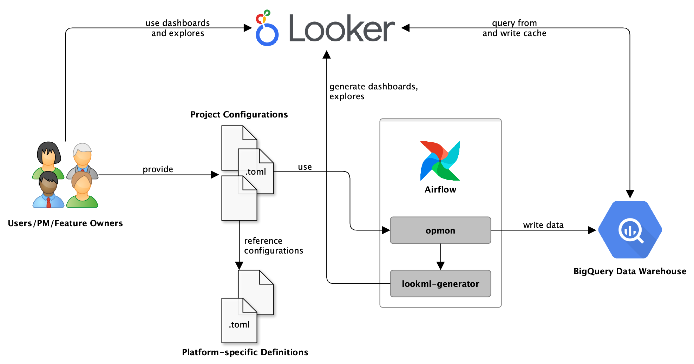
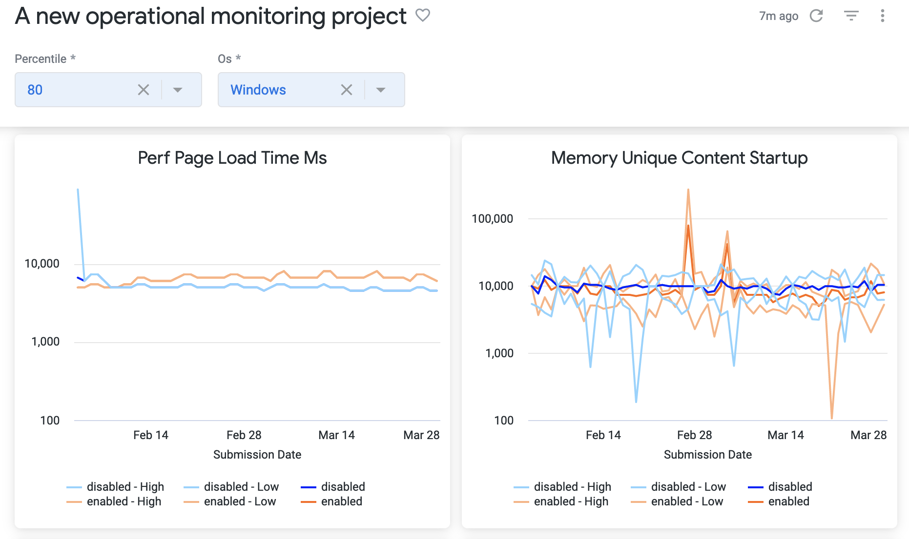

## Architecture



The diagram above shows the relationship between different parts of the Operational Monitoring system. At a high level, data flows through the system in the following way:

1. Users create project config files as described on [dtmo](https://docs.telemetry.mozilla.org/cookbooks/operational_monitoring.html) in [opmon/ in metric-hub](https://github.com/mozilla/metric-hub/tree/main/opmon)
2. Two daily jobs run in Airflow to process the config files: one to generate + run the ETL and one to generate LookML for views/explores/dashboards
3. Updated LookML dashboards and explores are available once per day and loading them runs aggregates on the fly by referencing relevant BigQuery tables.

Below we will dive deeper into what's happening under the hood.

## Generating the queries

OpMon pulls in the project configuration files and uses [Jinja](https://jinja.palletsprojects.com/en/3.0.x/) templates to generate different SQL queries to process the relevant data. At a high level, it works by doing the following steps for each project file:

First metric aggregations are computed at the client-level. The results are grouped by the branch, x-axis value (build id or submission date), and dimensions listed in the project config.
Normalization is done so that clients with many submissions would only count once.

The metric queries first determine the clients that should be part of the analysis (=population). The clients vary based on whether the OpMon project is monitoring rollouts, experiments or the overall population of a product. The query for determining clients which are part of a specific experiment can look as follows:

```sql
WITH population AS (
    SELECT
        DATE(submission_date) AS submission_date,
        client_id AS client_id,
        NULL AS build_id,
        CAST(normalized_os AS STRING) AS os, -- dimension clients will be segmented by
        mozfun.map.get_key(
          environment.experiments,
          "tcp-rollout-phase-2-demo"  -- slug of OpMon project
        ).branch AS branch,
    FROM (
        --------------- custom data source as defined in config ----------------
        WITH clients_per_branch AS (
            SELECT 
                client_id,
                sample_id,
                DATE(submission_timestamp) AS submission_date,
                application.build_id AS build_id,
                normalized_channel,
                normalized_os,
                normalized_country_code,
                CASE payload.processes.parent.scalars.privacy_dfpi_rollout_tcp_by_default_feature 
                    WHEN TRUE THEN "enabled"
                    ELSE "disabled"
                END AS branch
            FROM `moz-fx-data-shared-prod.telemetry.main`,
                UNNEST(environment.experiments) AS experiment
            WHERE 
                (normalized_channel = "beta") AND
                experiment.key IN (
                    "total-cookie-protection-beta-roll-out-phase-ii-switch-on-to-new-users", 
                    "total-cookie-protection-roll-out-to-users-phase-ii-switch-on-by-default"
                )
        )
        SELECT 
        client_id,
        submission_date,
        build_id,
        normalized_channel,
        normalized_os,
        normalized_country_code,
        STRUCT (    -- this is the structure opmon expects
            [
            STRUCT (
                "tcp-rollout-phase-2-demo" AS key,   -- dummy experiment/rollout slug to make opmon happy
                STRUCT(branch AS branch) AS value
            )
            ] AS experiments
        ) AS environment
        FROM clients_per_branch 
        WHERE branch IS NOT NULL
        -------------- end of custom data source config ---------------------
    )
    WHERE
        DATE(submission_date) = DATE('2022-06-08 00:00:00+00:00')
    GROUP BY
        submission_date,
        client_id,
        build_id,
        os,
        branch
)
SELECT * FROM population
```

For each client, metrics are subsequently getting computed like: 

```sql
WITH merged_metrics_main AS (
    SELECT
        DATE(DATE(submission_timestamp)) AS submission_date,
        client_id AS client_id,
        p.population_build_id AS build_id,
        ARRAY_AGG(mozfun.hist.extract(payload.processes.content.histograms.perf_first_contentful_paint_ms) IGNORE NULLS) AS perf_first_contentful_paint_ms,
    FROM
        mozdata.telemetry.main_1pct
    RIGHT JOIN
        ( 
            SELECT
                client_id AS population_client_id,
                submission_date AS population_submission_date,
                build_id AS population_build_id
            FROM
              population
        ) AS p
    ON
        DATE(submission_timestamp) = p.population_submission_date AND
        client_id = p.population_client_id
    WHERE
        DATE(DATE(submission_timestamp)) = DATE('2022-06-08 00:00:00+00:00')
    GROUP BY
        submission_date,
        build_id,
        client_id
),
merged_metrics_search_clients_engines_sources_daily AS (
    SELECT
        DATE(submission_date) AS submission_date,
        client_id AS client_id,
        p.population_build_id AS build_id,
        SUM(ad_click) AS ad_click,
    FROM
        mozdata.search.search_clients_engines_sources_daily
    RIGHT JOIN
        ( 
            SELECT
                client_id AS population_client_id,
                submission_date AS population_submission_date,
                build_id AS population_build_id
            FROM
              population
        ) AS p
    ON
        submission_date = p.population_submission_date AND
        client_id = p.population_client_id
    WHERE
        DATE(submission_date) = DATE('2022-06-08 00:00:00+00:00')
    GROUP BY
        submission_date,
        build_id,
        client_id
),
-- a CTE is generated for each data source
-- ... merged_metrics_[...] AS ()

-- combine the metrics from all the data sources
joined_metrics AS (
  SELECT
    population.submission_date AS submission_date,
    population.client_id AS client_id,
    population.build_id,
    population.os AS os,
    population.branch AS branch,
    perf_first_contentful_paint_ms,
  FROM population
  LEFT JOIN merged_metrics_main
  ON 
    merged_metrics_main.submission_date = population.submission_date AND
    merged_metrics_main.client_id = population.client_id AND
    (population.build_id IS NULL OR merged_metrics_main.build_id = population.build_id)
  LEFT JOIN merged_metrics_search_clients_engines_sources_daily
  ON 
    merged_metrics_search_clients_engines_sources_daily.submission_date = population.submission_date AND
    merged_metrics_search_clients_engines_sources_daily.client_id = population.client_id AND
    (population.build_id IS NULL OR merged_metrics_search_clients_engines_sources_daily.build_id = population.build_id)
)

SELECT * FROM joined_metrics
```

The per-client metric results are written to BigQuery tables in the `operational_monitoring_derived` dataset. The tables are named as follows: `<slug_with_underscores>_v1`.

The per-client metric results are used in the next step of the ETL to compute statistics. Statistics reduce observations of many clients to one or many rows describing the population.
The SQL executed to compute statistics depends on what statistics have been configured for each metric. But looks similar to the following: 

```sql
SELECT
    submission_date,
    build_id,
    branch,
    ARRAY<STRUCT<
            metric STRING,
            statistic STRING,
            point FLOAT64,
            lower FLOAT64,
            upper FLOAT64,
            parameter STRING
        >>[
        STRUCT(
            "install_volume_win8_1" AS metric,
            "sum" AS statistic,
            SUM(install_volume_win8_1) AS point,
            NULL AS lower,
            NULL AS upper,
            NULL AS parameter
        )
    ] AS install_volume_win8_1_sum
FROM `operational_monitoring.<slug_with_underscores>_v1`
```

Computing percentile statistics is a little more complicated than other supported statistics and involves bucketing results values and using a [Jackknife UDF](https://github.com/mozilla/opmon/blob/main/opmon/templates/jackknife_percentile_ci_udf.sql).
The ETL that is executed looks similar to the following: 

```sql
-- CREATE TEMP FUNCTION jackknife_percentile_ci 
-- see https://github.com/mozilla/opmon/blob/main/opmon/templates/jackknife_percentile_ci_udf.sql

-- CREATE TEMPORARY FUNCTION merge_histogram_values
-- see https://github.com/mozilla/opmon/blob/main/opmon/templates/merge_histogram_values_udf.sql

WITH filtered_metrics AS (
    SELECT *
    FROM `operational_monitoring.<slug_with_underscores>_v1`
    WHERE DATE(submission_date) >= DATE("2022-06-08 00:00:00+00:00")
),

-- bucket scalar metrics that use percentile
-- histogram metrics are already bucketed so this step is not necessary there
log_min_max AS (
  SELECT
    NULL AS dummy,
    LOG(IF(MIN(ad_click) <= 0, 1, MIN(ad_click)), 2) ad_click_log_min,
    LOG(IF(MAX(ad_click) <= 0, 1, MAX(ad_click)), 2) ad_click_log_max,
  FROM
    filtered_metrics
  LIMIT 1
),

buckets_by_metric AS (
  SELECT 
    NULL AS dummy,
    ARRAY(SELECT FORMAT("%.*f", 2, bucket) FROM UNNEST(
        mozfun.glam.histogram_generate_scalar_buckets(ad_click_log_min, ad_click_log_max, 100)
    ) AS bucket ORDER BY bucket) AS ad_click_buckets,
  FROM log_min_max
)

-- compute statistics
SELECT
    submission_date,
    build_id,
    os,
    branch,

    -- computing percentile for a scalar statistic
    -- the scalar values are transformed into a histogram data structure
    jackknife_percentile_ci(
        [25, 50, 75, 95],
        merge_histogram_values(
            ARRAY_CONCAT_AGG(
                histogram_normalized_sum(
                    [IF(False AND ad_click IS NULL,
                        NULL,
                        STRUCT<values ARRAY<STRUCT<key FLOAT64, value FLOAT64>>>(
                        [STRUCT<key FLOAT64, value FLOAT64>(
                            COALESCE(
                                mozfun.glam.histogram_bucket_from_value(
                                    ad_click_buckets,
                                    SAFE_CAST(ad_click AS FLOAT64)
                                ), 0.0
                            ), 1.0
                        )]
                    ))], 1.0
                )
            )
        ),
        "ad_click"
    ) AS ad_click_percentile,

    -- computing percentile for a histogram metric
    jackknife_percentile_ci(
        [25, 50, 75, 95],
        merge_histogram_values(
            ARRAY_CONCAT_AGG(
                histogram_normalized_sum(perf_first_contentful_paint_ms, 1.0)
            )
        ),
        "perf_first_contentful_paint_ms"
    )
    AS perf_first_contentful_paint_ms_percentile
FROM `operational_monitoring.<slug_with_underscores>_v1`
CROSS JOIN buckets_by_metric
WHERE submission_date = DATE("2022-06-08 00:00:00+00:00")
GROUP BY
    submission_date,
    build_id,
    os,
    branch
```


Although a single set of SQL templates is used, in order to support both build IDs and submission dates on the x-axis, the data is aggregated in slightly different ways for each case.
* For submission dates on the x-axis, submission date is also used as the partition.
* For build IDs on the x-axis, submission date is used as the partition but for each build ID up to 30 days of previous data will be aggregated. Each partition/submission date will include data of the builds that were released in the last 30 days.

The [Operational Monitoring DAG](https://workflow.telemetry.mozilla.org/tree?dag_id=operational_monitoring) runs once per day in Airflow.

A separate table is generated for each operational monitoring project + metrics, statistics and alerts.


## LookML Generator

Looker dashboards, views and explores for Operational Monitoring are generated via [lookml-generator](https://github.com/mozilla/lookml-generator) which runs daily as part of the [probe_scraper DAG](https://workflow.telemetry.mozilla.org/tree?dag_id=probe_scraper). Each run performs the following steps:

1) A view is generated for each result table. The view contains the dimensions (e.g. metric, branch, build_id) and a measure that computes percentiles
2) Explores are generated for each view, these include Looker [aggregate tables](https://docs.looker.com/reference/explore-params/aggregate_table) for each graph shown in the default view of a dashboard
3) Dashboards are generated for each project


## Output

Below is an example of a dashboard generated by Operational Monitoring for the [Fission Release Rollout](https://mozilla.cloud.looker.com/dashboards/operational_monitoring::fission_release_rollout?Percentile=50&Cores%20Count=2&Os=Windows)



Note that the dropdowns shown, aside from `Percentile` are generated based on the project definition. There is one dropdown for each dimension specified and it is populated by querying unique values for that dimension. The default value for each dropdown is the most common value found in the table.
