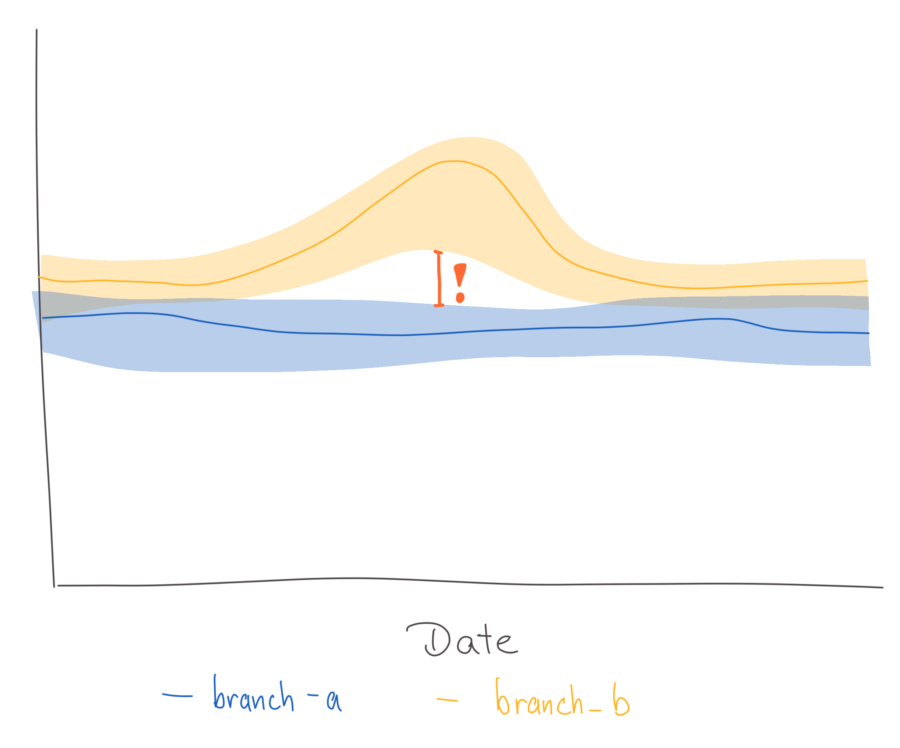
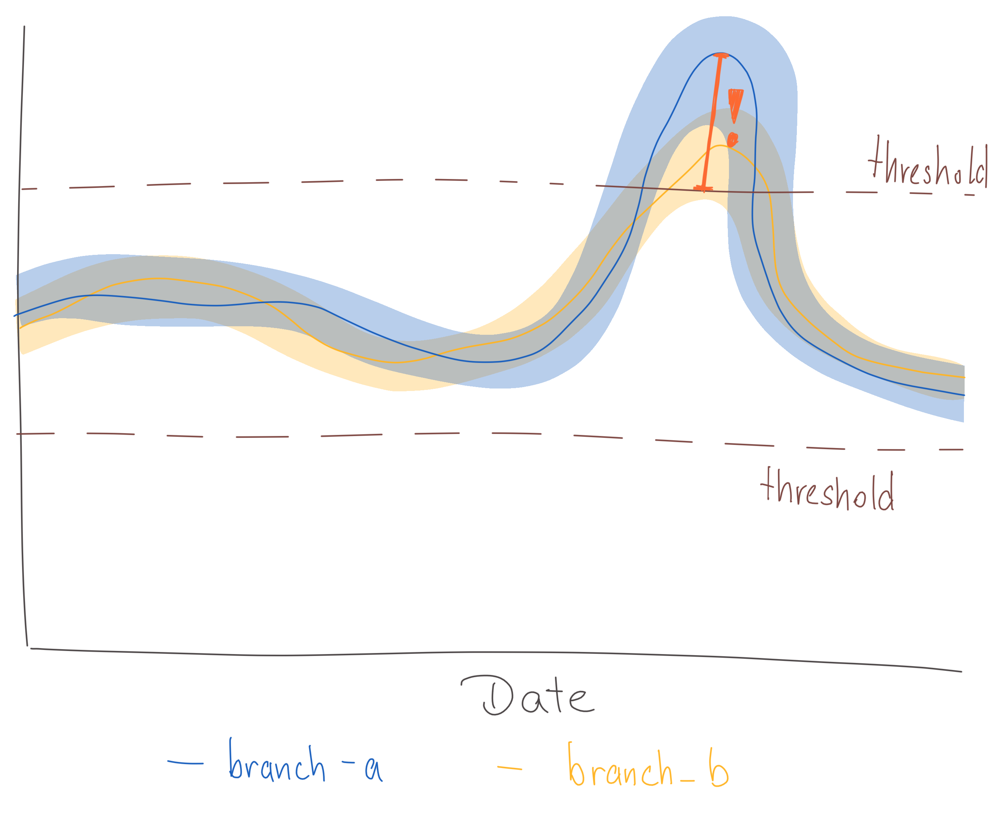
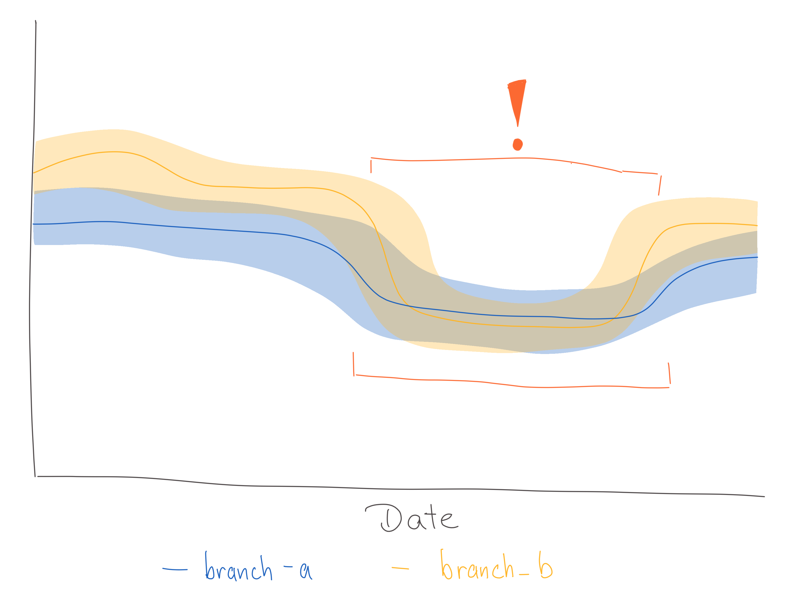

# Alerting in OpMon

* Author: Anna Scholtz
* Date: 2022-04-26
* Status: Accepting Feedback (Feedback from DS is especially welcome)

## Introduction

Users of OpMon want to be able to see critical changes and optionally get notified whenever they occur. This ADR describes how OpMon will provide the ability to define different monitors, how they will be implemented and how users can subscribe to getting email notifications.

## Constraints

There are a couple of constraints when checking for critical changes in OpMon:
* **Cost:** We will want to keep the cost low since there will be a lot of dashboards (for example, we create one for each rollout)
* **Computation Speed:** The operational monitoring dashboards get updated on a daily basis and there are usually dozens of dashboards that need to get updated. Ideally, the checks for each dashboard and day finish within minutes rather than hours.
* **Minimize False Positives:** Sending alerts when nothing is wrong too many times results in users simply ignoring alerts at some point

## Monitor Types

When talking to users there are a few different cases when they would like to receive an alert:
* **Large differences between branches:** Whenever the confidence intervals of different branches for a specific metric no longer overlap, it indicates that there is potentially some significant difference.
* **Thresholds:** Comparing the values of a metric to a user-defined threshold.
* **Deviation from historical data:** Detect anomalous behaviour of a metric based on previously collected data.

### Large differences between branches

The OpMon dashboards show the values for specific metrics as a line chart with confidence intervals. Each line represents the metric values for a different branch. Whenever the confidence intervals of the branches do not overlap, it is considered a critical change. See:



These checks need to be manually configured for specific metrics/probes. The OpMon configuration files will be extended to something like this:

```toml
[alert]

[alert.crashes] # new alert
type = "ci"
probes = [      # list of metrics to check
    "startup_crashes", 
    "main_crashes", 
    "oom_crashes"
]
percentiles = [50, 90]  # percentiles that should be considered
```

[todo: explain why not default, large variations for some metrics (tab counts)]

The implementation will be done as part of the Looker explores for each OpMon project. An additional dimension will be added to the generated explore that checks for each metric whether the confidence intervals of the available branches are not overlapping. This check is done for each day.


### Thresholds

In some cases the expected value of a metric is known and any large deviation from that expected value is considered a critical change. Fixed thresholds can be used to specify when a value is too large or too low. See:



These checks need to be manually configured for specific metrics/probes. The OpMon configuration files will be extended to something like this:

```toml
[alert]

[alert.crashes] # new alert
type = "threshold"
min = 0         # upper threshold [optional]
max = 10        # lower threshold [optional]
probes = [      # list of metrics to check
    "startup_crashes", 
    "main_crashes", 
    "oom_crashes"
]
percentiles = [50, 90]  # percentiles that should be considered
```

An `[alert]` section can be added to configuration files as well as definition files to specify alerts.
The minimum and maximum threshold value as well as the metrics the check should be applied to can be specified.
A list of percentiles needs to be provided that are being checked.

The check will performed on daily metric values. The alert configuration will need to be parsed, be made avaialble in BigQuery and exposed in Looker. Inside of Looker a dimension will be implemented that will perform the check based on the configured thresholds. 

### Deviation from historical data

Users want to get notified if a metric changed unexpectedly, for example after a new version got released. See:



It is not always possible to define a specific threshold, instead previously recorded data should be used to detect significant deviations.

This check is the most complicated and computation-intensive one with potentially the highest number of false positives. There are a lot of different anomaly detection algorithms out there, but for OpMon the idea is to implement the following:  

* Exponentially Weighted Moving Average
    * no need to specify window
        * consider all historic data points but only put a lot of weight on more recent ones (more relevant)
    * to give less weight to very old data points, use weighted average
        * spike in the past should idealy not trigger alert
    * alpha - smoothing factor; r - window size  
    * assumes gaussian distribution of data points
    * formula
    * for calculating stdev keep track of 2 EWMA (one with squared values, one normal)
    * memory and CPU efficient
    * could potentially inflace control lines to cause missed alarams after
    * only works for metrics with no seasonality (memory)
* smoothing to elminate the effects of large spikes (bidirectional smoothing)
    * larger time delay
        * smoothed value is available only after enough future values have been observed
    * more CPU, memory
        * symmetrical smooting: needs half window size after to get value


* create separate Looker views and explores for computing EWMA + UNION WITH other alerts


* EWMA
* seasonality


## Displaying Changes


## Notifications


## Implementation


## Alternatives Considered

* ARIMA, SARIMA