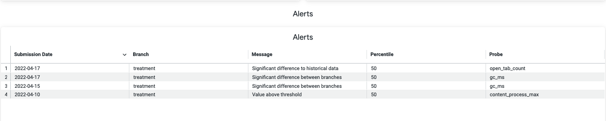
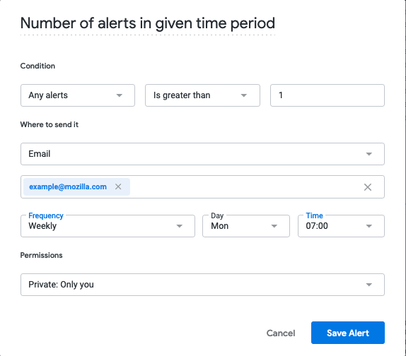

# Alerting in OpMon

* Author: Anna Scholtz
* Date: 2022-04-26
* Status: Accepting Feedback (Feedback from DS is especially welcome)

## Introduction

Users of OpMon want to be able to see critical changes and optionally get notified whenever they occur. This ADR describes how OpMon will provide the ability to define different monitors, how they will be implemented and how users can subscribe to getting email notifications.

## Constraints

There are a couple of constraints when checking for critical changes in OpMon:
* **Cost:** We will want to keep the cost low since there will be a lot of dashboards (for example, we create one for each rollout)
* **Computation Speed:** The operational monitoring dashboards get updated on a daily basis and there are usually dozens of dashboards that need to get updated. Ideally, the checks for each dashboard and day finish within minutes rather than hours.
* **Minimize False Positives:** Sending alerts when nothing is wrong too many times results in users simply ignoring alerts at some point

## Monitor Types

When talking to users there are a few different cases when they would like to receive an alert:
* **Large differences between branches:** Whenever the confidence intervals of different branches for a specific metric no longer overlap, it indicates that there is potentially some significant difference.
* **Thresholds:** Comparing the values of a metric to a user-defined threshold.
* **Deviation from historical data:** Detect anomalous behaviour of a metric based on previously collected data.

### Large differences between branches

The OpMon dashboards show the values for specific metrics as a line chart with confidence intervals. Each line represents the metric values for a different branch. Whenever the confidence intervals of the branches do not overlap, it is considered a critical change. See:


These checks need to be manually configured for specific metrics/probes. The OpMon configuration files will be extended to something like this:

```toml
[alert]

[alert.crashes] # new alert
type = "ci"
probes = [      # list of metrics to check
    "startup_crashes", 
    "main_crashes", 
    "oom_crashes"
]
percentiles = [50, 90]  # percentiles that should be considered
```

The implementation will be done as part of the Looker explores for each OpMon project. An additional dimension will be added to the generated explore that checks for each metric whether the confidence intervals of the available branches are not overlapping. This check is done for each day.


### Thresholds

In some cases the expected value of a metric is known and any large deviation from that expected value is considered a critical change. Fixed thresholds can be used to specify when a value is too large or too low. See:


These checks need to be manually configured for specific metrics/probes. The OpMon configuration files will be extended to something like this:

```toml
[alert]

[alert.crash_diffs] # new alert
type = "threshold"
precentiles = [50, 90] # percentiles that should be considered
min = [0, 0]          # upper threshold for each percentile [optional]
max = [10, 50]        # lower threshold for each percentile [optional]
probes = [      # list of metrics to check
    "startup_crashes", 
    "main_crashes", 
    "oom_crashes"
]
```

An `[alert]` section can be added to configuration files as well as definition files to specify alerts.
The minimum and maximum threshold value as well as the metrics the check should be applied to can be specified.
A list of percentiles needs to be provided that are being checked.

The check will performed on daily metric values. The alert configuration will need to be parsed, be made avaialble in BigQuery and exposed in Looker. Inside of Looker a dimension will be implemented that will perform the check based on the configured thresholds. 

### Deviation from historical data

Users want to get notified if a metric changed unexpectedly, for example after a new version got released. See:


It is not always possible to define a specific threshold, instead previously recorded data should be used to detect significant deviations.

This check is the most complicated and computation-intensive one with potentially the highest number of false positives. There are a lot of different anomaly detection algorithms out there, but for OpMon the idea is to detect these anomalies using the exponentially weighted moving average (EWMA):

$\text{EWMA}_t = \alpha * \text{v}_t + (1 - \alpha) * \text{EWMA}_{t-1}$

* $\alpha$: configurable weight; larger values result in more recent recorded values having a larger impact on the moving average (= they will have a higher weight)
* v: value of a specific metric
* $\text{EWMA}_0$: the starting point, which is equal to the first value recorded for the metric
* $t$: observation day

EWMA considers all historic values but puts a lot of weight on more recent values, older values are given less weight. This should ensure that spikes recorded in the past are less likely to trigger future alerts.

Control limits are determined by calculating the standard deviation:

$\text{Stdev}(v)_t = \sqrt(\text{EWMA}(v^2)_t - \text{EWMA(v)^2_t})$

If the recorded values for a metric exceeds $\text{EWMA}_t + \text{Stdev}(v)_t$ or is below $\text{EWMA}_t - \text{Stdev}(v)_t$, then a change is present.

This method is memory and CPU efficient and can be easily implemented in SQL. It only works for metrics with no seasonality. In the case of OpMon most operational metrics, like memory consumption or different load times, are not influenced by different week days or holidays.

A few drawbacks of this methods are that over time the control limits can get temporarily inflated after a spike and changes could go unnoticed afterwards. Slow changes will go unnoticed, for example if a metric slowly degrades over a long period of time, the average will adjust to it instead of noticing the change.
Another issue is that for computing the percentiles for each metric, values need to get bucketed. Depending on the resolution of these buckets, value changes do not show up as steady changes but instead as sudden jumps. This could potentially trigger this check if the resolution of the bucketes is low.

This check needs to be configured for metrics like:


```toml
[alert]

[alert.crash_changes] # new alert
type = "ema"
precentiles = [50, 90] # percentiles that should be considered
alpha = 0.4
probes = [      # list of metrics to check
    "startup_crashes", 
    "main_crashes", 
    "oom_crashes"
]
```


## Displaying Changes and Notifications

Significant changes are displayed in a table on the OpMon dashboard. For example:



Users can opt-in to receiving notifications via email by creating a new alert on the table in Looker:




## Implementation

OpMon configuration files and configuration parsing logic needs to be extended to allow configuring the alerts described above.

For each OpMon project a new view `operational_monitoring.<opmon_slug>_alerting` will be automatically generated that implements the checks. The view will look something like this:

```sql
-- A UDF for computing the exponentially weighted moving average (EWMA)
CREATE TEMP FUNCTION ewma(arr ARRAY<FLOAT64>, alpha FLOAT64) 
RETURNS STRUCT<ewma FLOAT64, stdev FLOAT64>
LANGUAGE js AS r"""
  function ewma(a, alpha) {
    var emaArray = [a[0]];
    var varianceArray = [a[0]*a[0]];
    for (var i = 1; i < a.length; i++) {
      emaArray.push(a[i] * alpha + emaArray[i - 1] * (1 - alpha));
      varianceArray.push(a[i]*a[i] * alpha + varianceArray[i - 1] * (1 - alpha));
    }
    return {
      "ewma": emaArray[emaArray.length - 1],
      "stdev": Math.sqrt(varianceArray[varianceArray.length - 1] - Math.pow(emaArray[emaArray.length - 1],2))
     };
  }
  return ewma(arr, alpha);
""";


WITH measured_values AS (
  -- get all scalar and histogram value for each day; group by metric and branch
  SELECT
    submission_date,
    probe,
    branch,
    STRUCT(
        mozfun.hist.merge(
          ARRAY_AGG(
            bug_1751307_pref_tab_unloading_on_low_memory_for_linux_release_97_98_histogram.histogram IGNORE NULLS
          )
        ).values AS values
    ) AS values
  FROM operational_monitoring.bug_1751307_pref_tab_unloading_on_low_memory_for_linux_release_97_98_histogram
  GROUP BY
    submission_date,
    probe,
    branch
  UNION ALL
  SELECT
    submission_date,
    probe,
    branch,
    STRUCT<values ARRAY<STRUCT<key FLOAT64, value FLOAT64>>>(mozfun.map.sum(
        ARRAY_AGG(
            STRUCT<key FLOAT64, value FLOAT64>(
                SAFE_CAST(COALESCE(value, 0.0) AS FLOAT64), 1
            )
        )
    )) AS values
  FROM operational_monitoring.bug_1751307_pref_tab_unloading_on_low_memory_for_linux_release_97_98_scalar
  GROUP BY
    submission_date,
    probe,
    branch
),

ci_overlaps AS (
  -- check if confidence intervals between branches overlap  
  SELECT
    measured_values.submission_date,
    measured_values.probe,
    measured_values.branch,
    ((udf_js.jackknife_percentile_ci(percentile, ref.values).high <= udf_js.jackknife_percentile_ci(percentile, measured_values.values).high AND udf_js.jackknife_percentile_ci(percentile, measured_values.values).low <= udf_js.jackknife_percentile_ci(percentile, ref.values).high) OR
    (udf_js.jackknife_percentile_ci(percentile, measured_values.values).low <= udf_js.jackknife_percentile_ci(percentile, ref.values).low AND udf_js.jackknife_percentile_ci(percentile, ref.values).low <= udf_js.jackknife_percentile_ci(percentile, measured_values.values).high) OR
    (udf_js.jackknife_percentile_ci(percentile, measured_values.values).high <= udf_js.jackknife_percentile_ci(percentile, ref.values).high AND udf_js.jackknife_percentile_ci(percentile, ref.values).low <= udf_js.jackknife_percentile_ci(percentile, measured_values.values).high) OR
    (udf_js.jackknife_percentile_ci(percentile, ref.values).low <= udf_js.jackknife_percentile_ci(percentile, measured_values.values).low AND udf_js.jackknife_percentile_ci(percentile, measured_values.values).low <= udf_js.jackknife_percentile_ci(percentile, ref.values).high)) AS ci_overlap,
    percentile
  FROM measured_values, 
    UNNEST([50]) AS percentile  -- percentiles to check
  JOIN measured_values AS ref
  ON measured_values.submission_date = ref.submission_date AND
    measured_values.branch != ref.branch AND
    measured_values.probe = ref.probe
  WHERE ref.branch = "tab-unloading-disabled" -- reference branch
),

ewma AS (
  -- compute EWMA  
  SELECT
    submission_date,
    probe,
    branch,
    udf_js.jackknife_percentile_ci(50, values) as ci,
    ewma(ARRAY_AGG(udf_js.jackknife_percentile_ci(50, values).percentile) OVER (PARTITION BY branch, probe ORDER BY submission_date DESC), 0.49) AS ewma_percentile
  FROM measured_values
)

-- checks for thresholds
SELECT
  submission_date,
  probe,
  branch,
  50 AS percentile,
  "Value below threshold" AS message
FROM measured_values
WHERE 
  udf_js.jackknife_percentile_ci(50, values).high <= 22 AND probe = "gc_max_pause_2"
-- UNION ALL
-- ...

-- checks for differences in CI
UNION ALL
SELECT
  submission_date,
  probe,
  branch,
  percentile,
  "Significant difference between branches" AS message
FROM ci_overlaps
WHERE 
  probe IN ('gc_ms', 'gc_max_pause_2_content', 'js_pageload_delazification_ms')  -- list of probes check is done for
  AND ci_overlap = FALSE

-- checks for significant changes
UNION ALL
SELECT
    submission_date,
    probe,
    branch,
    50 AS percentile,
    "Significant difference to historical data" AS message
FROM ewma 
WHERE probe IN ("gc_ms")
  AND (ewma_percentile.ewma - ewma_percentile.stdev > ci.high OR ewma_percentile.ewma + ewma_percentile.stdev < ci.low)
```

The query currently does not account for external configurations, but can be easily changed to incorporate those.


## Alternatives Considered

* ARIMA, SARIMA
* comparing windows


create temp table measured_values as (
  SELECT
      submission_date,
      probe,
      branch,
      udf_js.jackknife_percentile_ci(50, STRUCT(
          mozfun.hist.merge(
            ARRAY_AGG(
              bug_1751307_pref_tab_unloading_on_low_memory_for_linux_release_97_98_histogram.histogram IGNORE NULLS
            )
          ).values AS values
      )) as percentile
    FROM operational_monitoring.bug_1751307_pref_tab_unloading_on_low_memory_for_linux_release_97_98_histogram
    GROUP BY
      submission_date,
      probe,
      branch
  );

WITH RECURSIVE
  T AS (
    SELECT submission_date,
      0.5 AS alpha,
      row_number() OVER (ORDER BY submission_date) AS rn,
       percentile
    FROM hist_values
  ),
  
  ema AS (
    SELECT *, percentile AS percentile_ema FROM T
    WHERE rn = 1
    UNION ALL
    SELECT
      t2.submission_date,
      t2.alpha,
      t2.rn,
      t2.percentile,
      t2.alpha * t2.percentile + (1.0 - t2.alpha) * ema.percentile as percentile_ema
    FROM ema
    JOIN T t2 on ema.rn = t2.rn - 1
  )
SELECT submission_date, percentile, percentile_ema FROM ema


CREATE TEMP FUNCTION ewma(arr ARRAY<FLOAT64>, alpha FLOAT64) 
RETURNS STRUCT<ewma FLOAT64, stdev FLOAT64>
LANGUAGE js AS r"""
  function ewma(a, alpha) {
    //alpha = 2/(a.length + 1);
    alpha = 
    var emaArray = [a[0]];
    var varianceArray = [a[0]*a[0]];
    for (var i = 1; i < a.length; i++) {
      emaArray.push(a[i] * alpha + emaArray[i - 1] * (1 - alpha));
      varianceArray.push(a[i]*a[i] * alpha + varianceArray[i - 1] * (1 - alpha));
    }
    return {
      "ewma": emaArray[emaArray.length - 1],
      "stdev": Math.sqrt(varianceArray[varianceArray.length - 1] - Math.pow(emaArray[emaArray.length - 1],2))
     };
  }
  return ewma(arr, alpha);
""";


WITH hist_values AS (
  SELECT
    submission_date,
    probe,
    branch,
    STRUCT(
        mozfun.hist.merge(
          ARRAY_AGG(
            bug_1751307_pref_tab_unloading_on_low_memory_for_linux_release_97_98_histogram.histogram IGNORE NULLS
          )
        ).values AS values
    ) AS values
  FROM operational_monitoring.bug_1751307_pref_tab_unloading_on_low_memory_for_linux_release_97_98_histogram
  GROUP BY
    submission_date,
    probe,
    branch
  UNION ALL
  SELECT
    submission_date,
    probe,
    branch,
    STRUCT<values ARRAY<STRUCT<key FLOAT64, value FLOAT64>>>(mozfun.map.sum(
        ARRAY_AGG(
            STRUCT<key FLOAT64, value FLOAT64>(
                SAFE_CAST(COALESCE(value, 0.0) AS FLOAT64), 1
            )
        )
    )) AS values
  FROM operational_monitoring.bug_1751307_pref_tab_unloading_on_low_memory_for_linux_release_97_98_scalar
  GROUP BY
    submission_date,
    probe,
    branch
),

ci_overlaps AS (
  SELECT
    hist_values.submission_date,
    hist_values.probe,
    hist_values.branch,
    ((udf_js.jackknife_percentile_ci(percentile, ref.values).high <= udf_js.jackknife_percentile_ci(percentile, hist_values.values).high AND udf_js.jackknife_percentile_ci(percentile, hist_values.values).low <= udf_js.jackknife_percentile_ci(percentile, ref.values).high) OR
    (udf_js.jackknife_percentile_ci(percentile, hist_values.values).low <= udf_js.jackknife_percentile_ci(percentile, ref.values).low AND udf_js.jackknife_percentile_ci(percentile, ref.values).low <= udf_js.jackknife_percentile_ci(percentile, hist_values.values).high) OR
    (udf_js.jackknife_percentile_ci(percentile, hist_values.values).high <= udf_js.jackknife_percentile_ci(percentile, ref.values).high AND udf_js.jackknife_percentile_ci(percentile, ref.values).low <= udf_js.jackknife_percentile_ci(percentile, hist_values.values).high) OR
    (udf_js.jackknife_percentile_ci(percentile, ref.values).low <= udf_js.jackknife_percentile_ci(percentile, hist_values.values).low AND udf_js.jackknife_percentile_ci(percentile, hist_values.values).low <= udf_js.jackknife_percentile_ci(percentile, ref.values).high)) AS ci_overlap,
    percentile
  FROM hist_values, 
    UNNEST([50]) AS percentile  -- percentiles to check
  JOIN hist_values AS ref
  ON hist_values.submission_date = ref.submission_date AND
    hist_values.branch != ref.branch AND
    hist_values.probe = ref.probe
  WHERE ref.branch = "tab-unloading-disabled" -- reference branch
),

ewma AS (
  SELECT
    submission_date,
    probe,
    branch,
    udf_js.jackknife_percentile_ci(50, values) as ci,
    ewma(ARRAY_AGG(udf_js.jackknife_percentile_ci(50, values).percentile) OVER (PARTITION BY branch, probe ORDER BY submission_date DESC), 0.45)  AS ewma_percentile
  FROM hist_values
)

-- -- checks for thresholds
-- SELECT
--   submission_date,
--   probe,
--   branch,
--   50 AS percentile,
--   "Value below threshold" AS message
-- FROM hist_values
-- WHERE 
--   udf_js.jackknife_percentile_ci(50, values).high <= 22 AND probe = "gc_max_pause_2"
-- -- UNION ALL
-- -- ...

-- -- checks for differences in CI
-- UNION ALL
-- SELECT
--   submission_date,
--   probe,
--   branch,
--   percentile,
--   "Significant difference between branches" AS message
-- FROM ci_overlaps
-- WHERE 
--   probe IN ('gc_max_pause_2_content', 'js_pageload_delazification_ms')  -- list of probes check is done for
--   AND ci_overlap = FALSE

-- -- checks for significant changes
-- UNION ALL
SELECT
    submission_date,
    probe,
    branch,
    50 AS percentile,
    "Significant difference to historical data" AS message
FROM ewma 
WHERE probe IN ("gc_ms", "memory_pressure_count", "open_tab_event_count")
  AND (ewma_percentile.ewma - ewma_percentile.stdev > ci.high OR ewma_percentile.ewma + ewma_percentile.stdev < ci.low)
